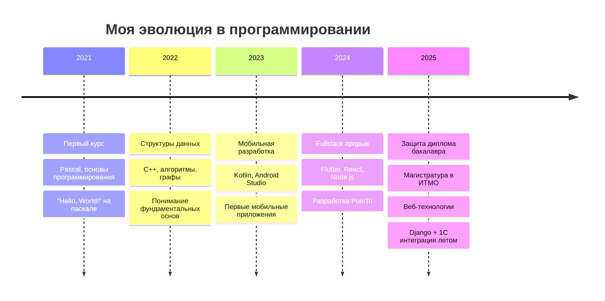

# 👋 Привет! Я Дмитрий Камков

<div align="center">
  
  
  
</div>

## 🎯 Кто я?

```typescript
const dmitry: Developer = {
  location: "Saint Petersburg 🏛️",
  education: {
    bachelor: "УрТИСИ СибГУТИ (09.03.01) ✅",
    master: "ИТМО (09.04.04 - Веб-технологии) 📚"
  },
  previousLife: "Профессиональный фигурист ⛸️",
  currentLife: "Fullstack разработчик 💻",
  superpower: "Превращаю идеи в код с элегантностью double акселя",
  workingOn: "PoinTo - кросс-платформенный таск-менеджер",
  learning: ["React", "Node.js", "Веб-технологии"],
  funFact: "Писал 1С интеграции летом - теперь ERP системы мне не страшны!"
};
```

<div align="center">
  
  
  
  

</div>

## 🚀 Мои проекты (почти все в Pinned Repos)

### 📱 PoinTo - Кросс-платформенный таск-менеджер
> 🎓 **Дипломный проект** | Flutter | Real-time синхронизация

**Что умеет:**
- ✉️ Подтверждение аккаунта через email
- 🔄 Real-time обновления между пользователями
- 👥 Совместная работа над проектами
- 📋 Назначение задач участникам команды
- 🎨 Кросс-платформенная магия Flutter

### 👟 Sneaker Shop - Складской учет
> React + Node.js + PostgreSQL + JWT

**Технологии:** `React` `Express` `PostgreSQL` `JWT` `Sequelize` `Bootstrap`

Полноценное клиент-серверное приложение для управления складом магазина кроссовок.

### 🎒 AppSTP - Travel Assistant  
> Kotlin | Android Studio | Weather API

Умное приложение для путешественников с интеграцией погодного API для планирования поездок.

### 💼 Enterprise Django App
> Python | Django | 1C Integration | HTTP Services

Летний проект: написал с нуля корпоративное приложение с интеграцией к 1С через собственные HTTP-сервисы.

### 📚 САОД Projects
> Pascal | C++ | Data Structures

Реализации структур данных: связные списки, графы, алгоритмы - все с нуля для понимания фундаментальных основ.

## 🛠️ Мой технологический стек

<div align="center">

### Frontend


### Backend & Mobile


### Databases & Tools


### Legacy & Learning


</div>

## 📈 Evolution Timeline



## ⚡ Забавные факты

<details>
<summary>🎯 Дипломный survivor</summary>

<div align="center">

🎓 **Защитил диплом:** 25.06.2025 ✅


🏆 **Статус:** Выживший после дипломной защиты  
🎯 **Следующая цель:** Магистратура ИТМО

</div>

</details>

<details>
<summary>⛸️ От льда к коду</summary>

```
Профессиональный фигурист → Программист
Тройные прыжки → Тройная вложенность циклов
Perfection on ice → Perfect code execution
```

</details>

<details>
<summary>🏋️ Спортивное прошлое</summary>

- ⛸️ Фигурное катание (профессионально)
- 🏐 Волейбол (институтская секция) 
- ⚽ Футбол
- 💪 Спортзал

**Философия:** "Дисциплина в спорте = дисциплина в коде"

</details>

## 🎮 Мини-игра: Угадай технологию!

<details>
<summary>🔍 Нажми, чтобы увидеть код!</summary>

```dart
class TaskManager {
  final String id;
  final List<User> collaborators;
  
  Stream<Task> get realTimeUpdates => 
    _firestore.collection('tasks').snapshots();
    
  Future<void> assignTask(Task task, User user) async {
    // Какая технология? 🤔
  }
}
```

<details>
<summary>Ответ</summary>
🎯 **Flutter + Dart** из проекта PoinTo!
</details>

</details>

## 🌍 Где меня найти

<div align="center">

[](https://t.me/dkamkov)
[](https://linkedin.com/in/dmitry-kamkov-288a52385)
[](mailto:dmitry.kamkov@gmail.com)

</div>

## 💭 Текущие мысли

> "Каждый день учусь чему-то новому. Сегодня это веб-технологии, завтра - может быть, что-то совершенно неожиданное. Главное - не останавливаться!"

---

<div align="center">
  
  
  
  **⭐ Если тебе нравится то, что я делаю - поставь звездочку моим проектам!**
  
</div>

## 🎯 2025 Goals

- [ ] Освоить современные веб-фреймворки в магистратуре
- [ ] Получить первый commercial experience в веб-разработке
- [ ] Создать open-source проект, который будет полезен сообществу
- [ ] Выступить с докладом на IT-конференции

*Обновлено: Сентябрь 2025* 🚀
